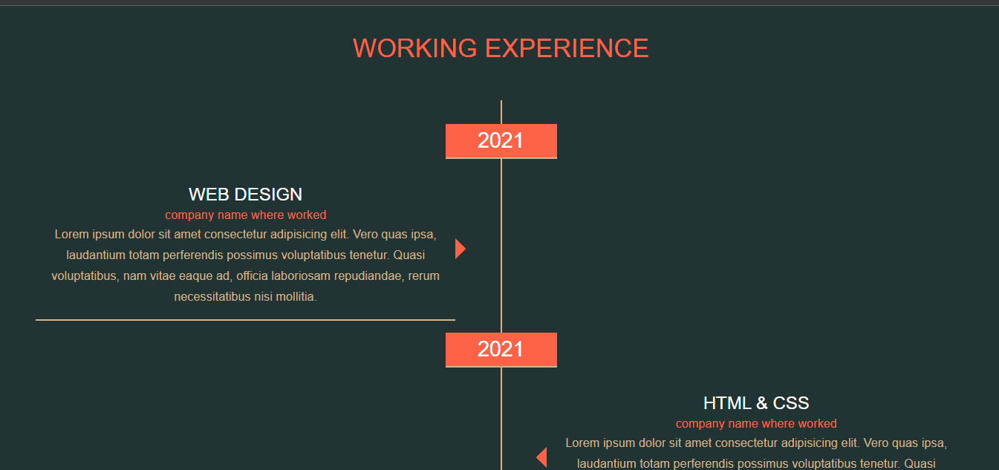
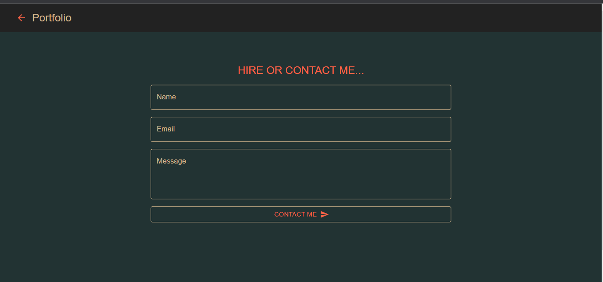

## Material UI Portfolio

A portfolio single page application using React and Material UI


#### To install dependency

```
npm install
```

#### To start the server

```
npm start
```

#### For Production Build

```
npm run build
```

Server will be available at http://127.0.0.1:3000 in your browser


## Portfolio



## Contact




<blockquote>
Muhammad Hamza Saleemi
Email: m.hamzasaleemi678@gmail.com
</blockquote>

========Thank You !!!=========
